# 開発経歴書（2026/07/08時点）

## ■職務要約

　プロジェクトを前に進めることを軸に、課題整理・論点整理・認識差分の整理・意思決定支援を通じて、開発の停滞解消に取り組んできました。

　こうした推進を担えている背景には、フルスタックエンジニアとしての経験をバックボーンに、業務フロー・データフロー・システム構成を横断的に理解し、システム全体を俯瞰する視点があります。

　企画・デザイン・開発・API・基盤など複数チームが関わる環境において、関係者間の認識合わせや意思決定支援、チーム横断での論点整理を担うことが多く、結果としてテックリードや開発ディレクションに近い役割を担うケースが多いです。

　また、単発の課題解決だけでなく、同じ課題が繰り返し発生しないよう、業務プロセスやコミュニケーションの改善にも継続的に取り組み、開発しやすい環境づくりを進めてきました。

　技術面では、PHP（FuelPHP / Laravel）を中心に、React / Next.js、API連携、DB設計、AWS、Dockerなど実装に継続して関わってきました。特にFuelPHP / jQuery中心のレガシー環境では、将来的なバックエンド更新を見据えたモジュール設計を行い、React導入・改善を段階的に推進しています。

　生成AIも実務に取り入れ、仕様や既存構造の整理、実装方針の明確化、レビュー支援などを通じて、開発の前進を支えています。

## ■スキル

| 分類                    | 内容                                                                                         |
| --------------------- | ------------------------------------------------------------------------------------------ |
| 言語 - 複数年の実務経験         | PHP / JavaScript                                                                           |
| 言語 └ 1年未満の実務経験/リリース有り | TypeScript / Python / Go                                                                   |
| 言語 - 過去に経験有り          | Java / C# / C++ / Ruby                                                                     |
| マークアップ他               | HTML / CSS / XML / Tailwind CSS / Twitter Bootstrap                                        |
| フレームワーク               | FuelPHP / jQuery / CakePHP / Laravel / React / Next.js / Echo / Rails / WordPress / Smarty |
| DB                    | MySQL / PostgreSQL / MongoDB                                                               |
| OS                    | Linux（CentOS / Amazon Linux 2 / Ubuntu） / Windows / macOS                                  |
| インフラ                  | AWS（実務利用経験あり） / Docker / Apache / Nginx                                                    |
| ソースコード管理              | Git / GitLab / Bitbucket / SVN                                                             |
| PJ管理                  | Backlog / Jira / Redmine                                                                   |
| ドキュメント・ナレッジ共有         | Confluence / Notion / Swagger / Jupyter Notebook                                           |
| 開発支援                  | PHPUnit / Selenium / Jenkins / Capistrano                                                  |
| AI活用                  | 生成AI（Claude Code / Codex）を実務に活用┣ 既存仕様・構造整理┣ 実装方針の整理┣ コードレビュー支援┣ 修正方針の具体化┣ 設計整合性確認┗ 品質観点の整理 |

## ■職務経歴（会社履歴）

| 期間                  | 所属                                                               |
| ------------------- | ---------------------------------------------------------------- |
| 2021年4月 ～ 現在        | フリーランス（個人事業主）                                                    |
| 2018年1月 ～ 2021年2月   | SES企業（正社員）同社にて複数プロジェクトに参画、代表案件のみ詳細記載                             |
| 2011年11月 ～ 2017年12月 | 家業における事業運営（飲食・サービス系／複数店舗・FC展開）事業として一区切りついており、現在は継続的に関わる状況ではありません |
| 2010年4月 ～ 2011年10月  | ソフトウェア開発企業（正社員）                                                  |

## ■開発経歴（案件詳細）

### No.1｜電子お薬手帳/予約サービスにおける薬局向けWebシステム

| 期間                       | メイン言語 | フレームワーク                  |
| ------------------------ | ----- | ------------------------ |
| 2021年8月 ～ 2026年3月（4年8ヶ月） | PHP   | FuelPHP / React / jQuery |

| その他                          | 担当工程                            | 担当役割                                  | 規模                               |
| ---------------------------- | ------------------------------- | ------------------------------------- | -------------------------------- |
| MySQL / AWS Lambda / Backlog | 要件整理 / システム設計 / 実装 / テスト / 運用改善 | 開発推進（課題整理 / 意思決定支援 / 実装） / UI領域サブリーダー | チーム20名 / 開発全体100名 / 契約薬局18,020店舗 |

#### ■プロジェクト概要

　電子お薬手帳、予約サービスにおける薬局向けWebシステム開発。\
　企画、ユーザー向けアプリ、Webメディア、基盤、APIなど複数チームが関わる環境で、UI領域サブリーダーとして開発を推進。\
　FuelPHP / jQueryベースの既存構成に対し、React導入・改善に関与しながら段階的モダン化と継続運用を両立しました。

#### ■担当業務

* 課題整理・論点整理・関係者間の認識合わせを行いながら開発推進を担当

* UI領域サブリーダーとして、要件整理、進捗管理、レビューを担当

* 企画、アプリ、Web、基盤、APIの各チーム間調整を担当

* APIチーム・フロントエンド・企画それぞれが持つシステム理解のギャップを埋める役割を担い、API仕様調整と実現案の整理を担当

* FuelPHP / jQueryベースの既存システムに対し、React導入・改善に関与

* 生成AIを活用し、既存仕様・構造整理、実装方針整理、レビュー支援を実施

* 将来的なバックエンド更新（Laravel移行）を見据え、モジュール設計で新規機能を実装

* Slack Listを活用したタスク・課題管理運用を提案・主導し、非同期コミュニケーションの改善を推進

* メンバーの技術フォロー、ソースレビュー、Git運用、品質観点の整理を担当

#### ■実績・取り組み

* 複数チームが関わる案件において、各チームが持つ前提や制約の認識差分を整理し、意思決定に必要な論点を構造化。関係者間の認識合わせを通じて、停滞していた案件の前進を支援した

* APIチーム・フロントエンド・企画それぞれが持つシステム理解のギャップを埋める役割を担い、仕様の解釈差分や制約条件を整理。システム全体の観点から実現可能な進め方を提示し、開発推進に寄与した

* FuelPHP / jQueryベースで肥大化していた既存画面に対し、将来的なバックエンド更新（Laravel移行）を見据えたモジュール単位でReactを段階的に導入。継続運用を止めずに影響範囲を限定しながらモダナイズを進めた

* 複数チーム・業務委託メンバーが混在し、依頼や確認事項がSlackの会話に流れて、進捗把握や個別フォローが定例MTG頼みになっていた課題に対し、Slack Listでのタスク・課題管理運用を提案・定着させた。非同期でもボールの所在と後工程での情報参照ができる状態を作り、ディレクションによる個別確認や同期MTGへの依存を軽減した

* 生成AIを実装フローに組み込み、既存仕様の把握・影響範囲の洗い出し・実装方針整理・レビューにかかる時間を短縮した

**■チーム構成図（開発推進時の関係者イメージ）**

* ディレクションに各チームとのMTG設定依頼

* API担当1名を伴い、各チームと仕様詳細打ち合わせ。打ち合わせ後マイルストーン設定

* リリース手前で企画・運用・サポートへヒアリング依頼、運用方針に合わせてチーム内外調整

* etc.（詳細は面接時にて）

### No.2｜ECアプリ/Webアプリ開発

| 期間                       | メイン言語                 | フレームワーク                  |
| ------------------------ | --------------------- | ------------------------ |
| 2021年6月 ～ 2024年9月（3年4ヶ月） | PHP / Go / TypeScript | Laravel / Next.js / Echo |

| その他                                 | 担当工程                            | 担当役割 | 規模              |
| ----------------------------------- | ------------------------------- | ---- | --------------- |
| MySQL / Confluence / Jira / Swagger | 要件整理 / システム設計 / 実装 / テスト / デプロイ | SE   | チーム5名 / 開発全体10名 |

#### ■プロジェクト概要

※副業案件\
　ECアプリ「Lafugo」のバックエンド開発、およびWebアプリ開発。\
　iOSアプリからWebアプリへの移行フェーズにも参画。

#### ■担当業務

* 決済領域を担当

* Stripe仕様調査、DB連携設計、決済処理実装を担当

* Stripe連携バッチの実装を担当

* Next.js / Echoの導入、Docker開発環境構築、開発、デプロイを担当

#### ■実績・取り組み

* Stripeを用いた決済機能を設計から実装まで担当

* iOSアプリからWebアプリへの移行を技術面から支援

* Next.js / Echo導入を含む新構成の立ち上げを担当

### No.3｜投資データ分析

| 期間                     | メイン言語  | フレームワーク        |
| ---------------------- | ------ | -------------- |
| 2021年5月 ～ 2021年7月（3ヶ月） | Python | Pandas / NumPy |

| その他                                                                             | 担当工程                          | 担当役割 | 規模             |
| ------------------------------------------------------------------------------- | ----------------------------- | ---- | -------------- |
| Notion / Docker / Amazon EC2 / PostgreSQL / MongoDB / Flyway / Jupyter Notebook | 要件整理 / システム設計 / 実装 / テスト / 調査 | SE   | チーム5名 / 開発全体9名 |

#### ■プロジェクト概要

　投資データ分析、顧客向け資料作成支援、データ調査・加工を行うプロジェクト。

#### ■担当業務

* 投資用データ取得機能の開発を担当

* Flywayを用いたDBマイグレーションを担当

* 営業資料向けデータ調査、分析アウトプットを担当

* API提供会社サポート窓口と現場マネージャーとの仕様確認を担当

* 英語ドキュメント、英語チャット環境での調査、対応を実施

#### ■実績・取り組み

* Pythonを短期でキャッチアップし、データ取得機能開発を推進

* API提供元との確認を通じて、仕様不明点を解消しながら実装を前進

* 顧客向け資料作成に必要な分析アウトプットを継続提供

### No.4｜教育メディア

| 期間                       | メイン言語                         | フレームワーク           |
| ------------------------ | ----------------------------- | ----------------- |
| 2019年8月 ～ 2021年2月（1年7ヶ月） | PHP / JavaScript / HTML / CSS | CakePHP2 / Smarty |

| その他                                                                                                                    | 担当工程                            | 担当役割 | 規模               |
| ---------------------------------------------------------------------------------------------------------------------- | ------------------------------- | ---- | ---------------- |
| Memcached / MySQL / Apache / Nginx / AWS / Bitbucket / Xdebug / JUnit / Selenium / Jenkins / Capistrano / Gulp / Babel | 要件整理 / システム設計 / 実装 / テスト / 運用改善 | SE   | チーム13名 / 開発全体18名 |

#### ■プロジェクト概要

　教育メディアのBtoBtoCサービス開発。\
　短いリリースサイクルの中で、仕様整理から開発、改善施策まで幅広く担当。

#### ■担当業務

* 企画要望をもとに、仕様整理から実装、リリースまで対応

* スケジュール管理、情報収集、担当者間調整を担当

* AWSプラン変更申請のための調査を担当

* Docker整備、デプロイ手順自動化など改善施策を推進

* 部署間調整時の進行設計とアナウンス対応を担当

#### ■実績・取り組み

* 週2回リリースの開発体制で、継続的な機能開発を推進

* Docker整備とデプロイ手順自動化により、開発効率と再現性を改善

* 業務フロー改善と部署間調整を通じて、開発の進めやすさを向上

### No.5｜住宅ハウスメーカー向け住宅保険登録・管理サービス

| 期間                      | メイン言語                         | フレームワーク     |
| ----------------------- | ----------------------------- | ----------- |
| 2018年11月 ～ 2019年7月（9ヶ月） | PHP / JavaScript / HTML / CSS | CakePHP 3.5 |

| その他                                        | 担当工程                            | 担当役割 | 規模              |
| ------------------------------------------ | ------------------------------- | ---- | --------------- |
| MySQL / Apache / GitLab / Xdebug / PHPUnit | 要件整理 / システム設計 / 実装 / テスト / 教育支援 | SE   | チーム6名 / 開発全体10名 |

#### ■プロジェクト概要

　住宅保険の登録、管理、帳票出力機能を持つBtoBtoCサービス開発。

#### ■担当業務

* 実装チームリーダーとして参画

* Docker開発環境、検証サーバ、GitLabローカル環境の構築を担当

* CRUD機能実装、仕様書作成、要望対応を担当

* メンバー実装支援、新人教育を担当

* 発注元との調整、デプロイ作業、デプロイ手順整備を担当

#### ■実績・取り組み

* Dockerを用いた再現性の高い開発環境を整備し、参画者の立ち上がりを短縮

* 実装チームリーダーとして、開発推進とメンバー支援の両面を担当

* 人員入替がある中でも、知識共有と標準化で開発継続性を維持

> ### No.6〜No.10｜担当案件（詳細省略）
>
> 期間：2018年1月 ～ 2018年10月（10ヶ月）
>
> * No.6｜医院予約サービス
>
> * No.7｜転職支援サービス
>
> * No.8｜製品紹介サービス
>
> * No.9｜スマホ向けゲーム機能追加開発
>
> * No.10｜ゲーム紹介サイト構築

### No.11｜CADアプリケーション追加機能開発

| 期間                        | メイン言語                              | フレームワーク        |
| ------------------------- | ---------------------------------- | -------------- |
| 2010年4月 ～ 2011年10月（1年7ヶ月） | Java / PowerShell / C++ / C# / XML | .NET Framework |

| その他                | 担当工程                     | 担当役割 | 規模               |
| ------------------ | ------------------------ | ---- | ---------------- |
| ASIS / HOOPS / SVN | システム設計 / 実装 / テスト / 保守運用 | SE   | チーム10名 / 開発全体10名 |

#### ■プロジェクト概要

　電気機器メーカー向けCAD設計ソフトの追加機能開発。

#### ■担当業務

* 基板設計図、実装プレビュー機能に関わる追加開発を担当

* JavaによるDB接続、データ処理機能を実装

* バックアップサーバ運用、ソース管理など周辺業務も担当

* PowerShellで定期、緊急バックアップや電源制御の自動化を実施

* 英語ドキュメント中心の商用ライブラリ調査を担当

#### ■実績・取り組み

* Javaによるデータ処理機能実装と周辺運用をあわせて担当

* PowerShellでバックアップ運用を自動化し、保守性を向上

* 英語ドキュメント調査を通じて商用ライブラリ実装へ反映

## ■基本情報

| 名前  | 年齢  | IT開発経験                           | 最寄駅   | 稼働開始   |
| --- | --- | -------------------------------- | ----- | ------ |
| K・K | 41歳 | 10年（Webシステム：8年3ヶ月／Windows：1年7ヶ月） | センター北 | 即日〜応相談 |

## ■最終学歴

2010年03月\
鹿児島大学大学院 理工学研究科 情報工学専攻 修了（修士）
